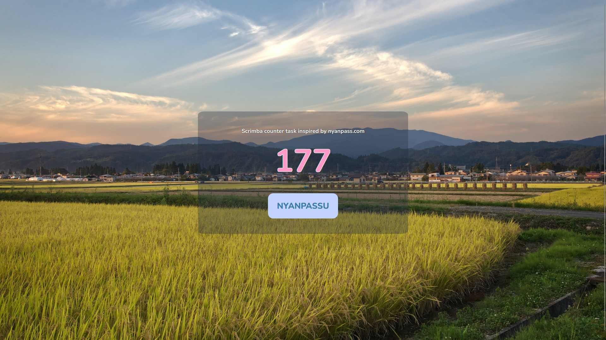

# Counter

This project was part of a optional Scrima.com task.
We were encouraged to create an application that counts the amounts of times a button has been clicked. 
Initially the project was to create a counter to count how many passengers got on a train. However for this task I decided to create a bootleg replication of another site I know of that counts the times it has been clicked. And when you click the button a sound is played. 

